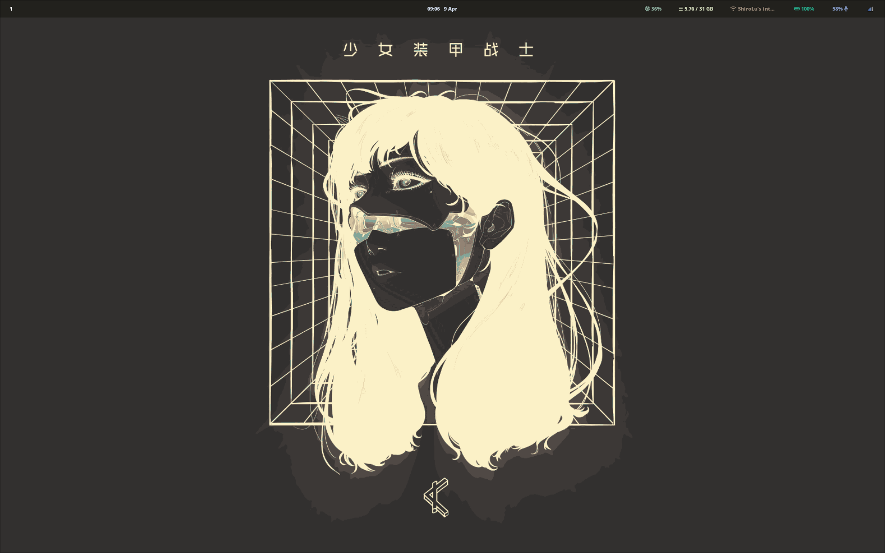
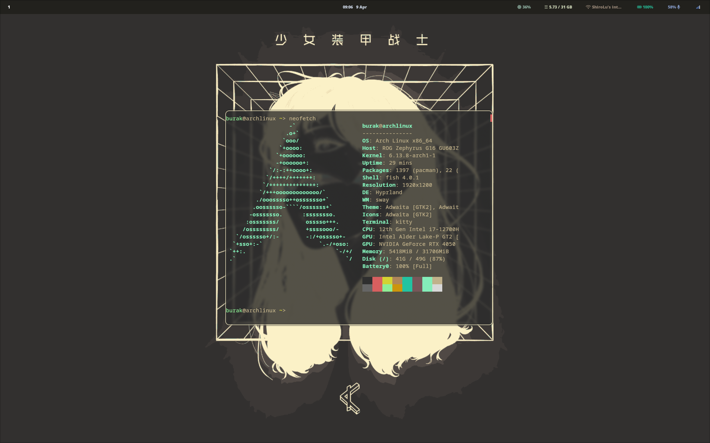
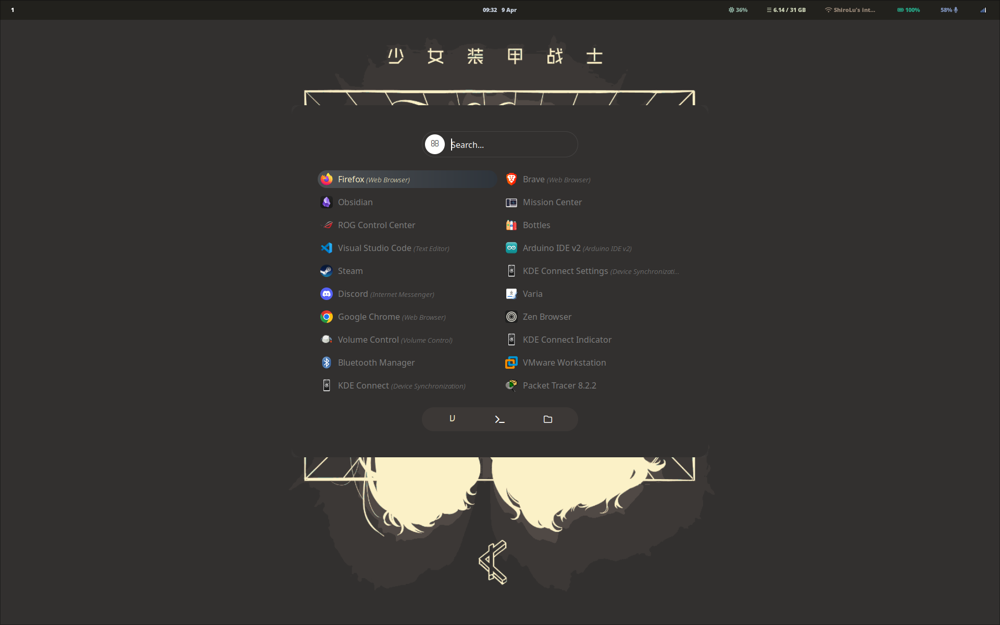

## Package Installation

```bash
# Download essential dependencies
sudo pacman -S --needed git curl wget base-devel --noconfirm

# Install Wayland and Hyprland environment
sudo pacman -S --needed wayland hyprland waybar hyprpaper kitty --noconfirm

# Install additional packages listed in packages.txt
sudo pacman -S --needed --noconfirm $(cat packages.txt)
```

## Copy Configuration Files

```bash
# Copy configuration files to ~/.config
mkdir -p ~/.config/{waybar,wallpapers}
cp -r ./config/waybar ~/.config/
cp -r ./wallpapers/* ~/.config/wallpapers/
cp -r ./kitty/* ~/.config/kitty/
cp -r ./nemo/* ~/.config/nemo/
cp -r ./rofi/* ~/.config/rofi/
cp -r ./waybar/* ~/.config/waybar/
cp -r ./nvim/* ~/.config/nvim/
cp -r ./hypr/* ~/.config/hypr/
cp -r ./dunst/* ~/.config/dunst/
```

## Themes

Custom Rofi themes from: [https://github.com/adi1090x/rofi](https://github.com/adi1090x/rofi)

Custom SDDM display themes from: [https://github.com/Keyitdev/sddm-astronaut-theme](https://github.com/Keyitdev/sddm-astronaut-theme)

---

## ScreenShots
- ScreenShots
    
    
    

---

## Hyprland Keybindings

| Key Combo             | Action                                                                 |
|----------------------|------------------------------------------------------------------------|
| `Mod + Q`            | Open terminal (`$terminal`)                                            |
| `Mod + Shift + C`    | Kill active window                                                     |
| `Mod + Shift + M`    | Exit Hyprland                                                          |
| `Mod + E`            | Open file manager (`$fileManager`)                                     |
| `Mod + V`            | Toggle floating mode                                                   |
| `Mod + R`            | Open application launcher (`$menu`)                                    |
| `Mod + F`            | Toggle fullscreen                                                      |
| `Mod + Z`            | Launch Firefox (Flatpak Zen browser)                                   |
| `Mod + Shift + L`    | Lock screen using `hyprlock`                                           |
| `Mod + H`            | Take full screenshot (`screenshot_full.sh`)                            |
| `Mod + Shift + H`    | Take area screenshot (`screenshot_area.sh`)                            |
| `Mod + A`            | Open clipboard history with Rofi + Cliphist                            |
| `Mod + Shift + A`    | Launch custom Rofi web search script (`rofi-web-search.sh`)            |

---

Feel free to customize the paths or configurations to suit your setup!