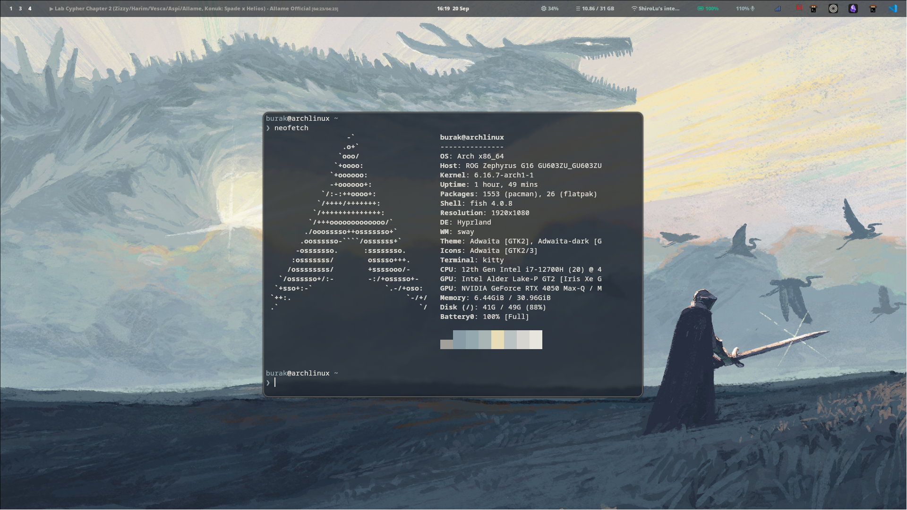
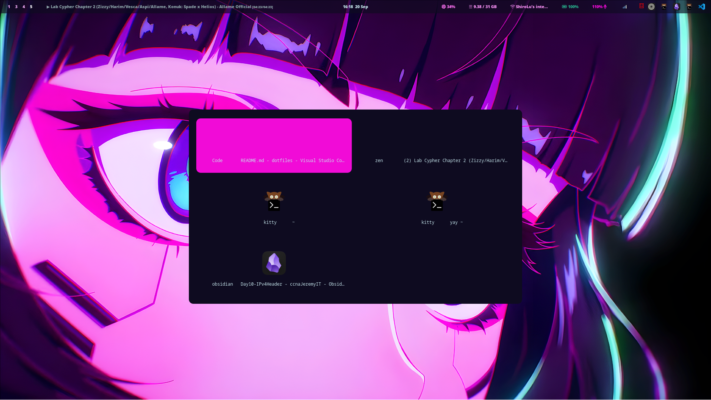

## Package Installation

```bash
# Download essential dependencies
sudo pacman -S --needed git curl wget base-devel wayland hyprland waybar hyprpaper kitty --noconfirm

# Install additional packages listed in packages.txt
sudo pacman -S --needed --noconfirm $(cat packages.txt)
```

## Copy Configuration Files

```bash
mkdir -p ~/.config/{waybar,wallpapers}
cp -r ./config/waybar ~/.config/
cp -r ./wallpapers/* ~/.config/wallpapers/
cp -r ./kitty/* ~/.config/kitty/
cp -r ./nemo/* ~/.config/nemo/
cp -r ./rofi/* ~/.config/rofi/
cp -r ./waybar/* ~/.config/waybar/
cp -r ./nvim/* ~/.config/nvim/
cp -r ./hypr/* ~/.config/hypr/
cp -r ./dunst/* ~/.config/dunst/
```

## Themes

Custom Rofi themes from: [https://github.com/adi1090x/rofi](https://github.com/adi1090x/rofi)

Custom SDDM display themes from: [https://github.com/Keyitdev/sddm-astronaut-theme](https://github.com/Keyitdev/sddm-astronaut-theme)


## Screenshots

<div align="center">

<br><br>


</div>


## Installation Notes

- Make sure you have a working Arch Linux installation
- Ensure Wayland is properly configured
- Some packages may require AUR (Arch User Repository)
